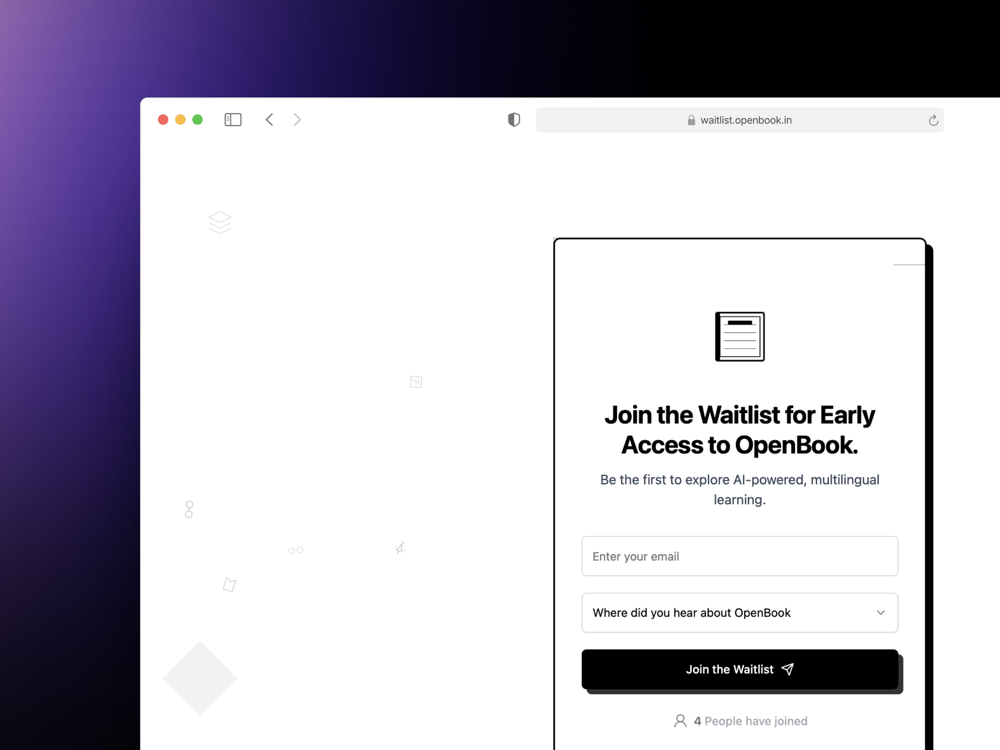

# OpenBook Waitlist

<p align="center">
  
</p>

**Join the Waitlist for Early Access to OpenBook. Be the first to explore AI-powered, multilingual learning.**

[🔗 View Live Demo](https://waitlist.goopenbook.in)

---

## 🚀 Features

- **Early Access**: Secure your spot for exclusive early access.
- **AI-Powered**: Personalized, adaptive learning driven by AI.
- **Multilingual**: Seamlessly learn in multiple languages.
- **Privacy-First**: We respect your privacy — no spam, just updates.

---

## 🛠️ Getting Started

```bash
# Clone the repository
git clone https://github.com/yourusername/openbook-waitlist.git
cd openbook-waitlist

# Install dependencies
npm install

# Run the development server
npm run dev
```

Open [http://localhost:3000](http://localhost:3000) in your browser to see the waitlist page.

---

## 📦 Deployment

This project is optimized for deployment on Vercel:

```bash
vercel deploy
```

---

## 📄 License

This project is licensed under the MIT License.
